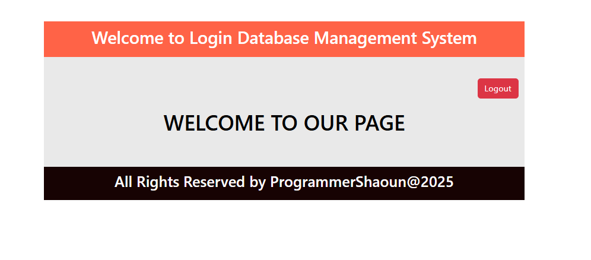

# Login and Registration Page (PHP + MySQL)

A simple **Login and Registration System** built with **PHP, MySQL, Bootstrap** and **Composer autoload** support.


## 📦 Installation

1. **Clone the repo**  
   ```bash
   git clone https://github.com/your-username/Login_and_Registration_Page.git
   cd Login_and_Registration_Page
    ````

2. **Install Composer dependencies**

   ```bash
   composer dump-autoload
   ```

   This will generate the `vendor/autoload.php` file which is already included in `action.php`.


## 🚀 Usage

* Start a local PHP server:

  ```bash
  php -S localhost:8000
  ```
* Open browser:
  👉 [http://localhost:8000/index.php](http://localhost:8000/index.php)


## 🔑 Features

* User Registration (with duplicate email check)
* User Login (session-based authentication)
* User Dashboard (protected, only logged-in users can access)
* Logout
* Success & Error messages (auto-hide)


## 📂 Project Structure

```
LOGIN_AND_REGISTRATION_PAGE/
│── app/
│   └── classes/
│       └── homeController.php
│── asset/css/
│   ├── login.css
│   └── style.css
│── db/
│   └── db.php
│── includes/
│   ├── footer.php
│   ├── header.php
│   └── message.php
│── pages/
│   ├── dashboard.php
│   ├── home.php
│   ├── login.php
│   ├── logout.php
│   ├── Reg.php
│   └── registration.php
│── vendor/
│── action.php
│── index.php
│── composer.json
└── README.md
```


## ⚠️ Security Note

Right now, passwords are stored as **plain text**.
👉 You should use PHP’s `password_hash()` and `password_verify()` for secure password handling.


## 🛠️ Future Improvements

* Hash passwords before storing
* Add CSRF protection
* Add email verification
* Improve UI with full Bootstrap 5


## Login Page
    


## Registration Page


## Profile Page


